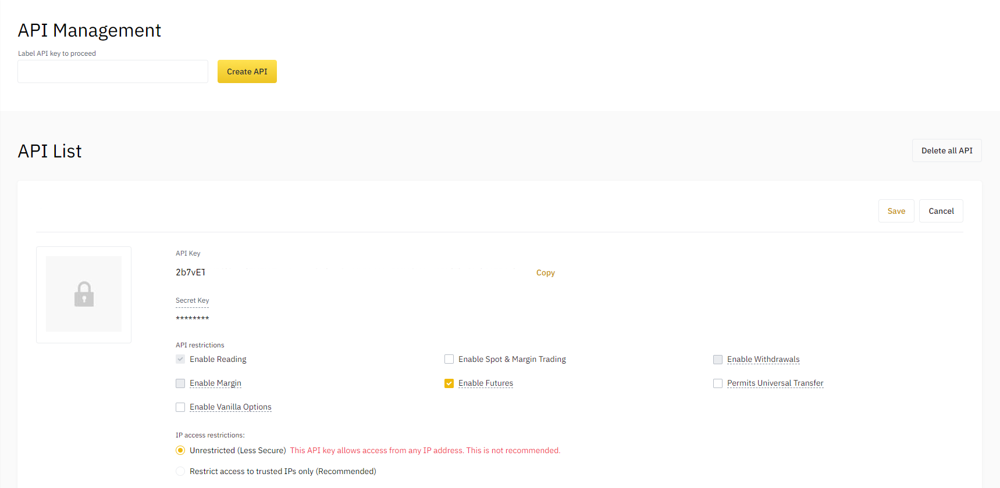
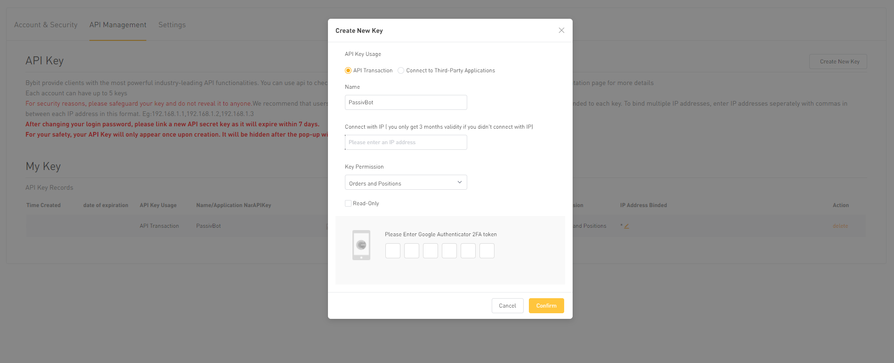

# Overview

PassivBot is an open source grid trading utility designed to trade “chop” or indecision in leveraged perpetual futures positions. Leveraged futures contracts are a risk intense derivative and should be approached with extreme caution, especially as the bot is under development. This article serves as a “plain English” overview of the bot and how it’s configurations work.  

### Index

[`-> Grid Trading`](#grid-trading)  
[`-> Preferential Grid Trading`](#preferential-grid-trading)  
[`-> PassivBot Implementation`](#passivbot-implementation)  
[`-> Configuration & API Keys`](#configuration--api-keys)  
[`-> Backtesting Configurations`](#backtesting-configurations)  
[`-> Analyzing Results: Jupyter-Lab`](#analyzing-results-jupyter-lab)  
[`-> Live Usage`](#live-usage)  

***

## Grid Trading

PassivBot uses a preferential buy / sell grid to scalp trade indecisive price action. A grid consists of a range of buy and sell orders wherein a position is entered, and doubled down on as the price moves against the trade. This is known as the [Martingale Strategy](https://en.wikipedia.org/wiki/Martingale_(probability_theory)) and is a key factor of Passiv's underlying strategy. Dollar cost averaging into the position averages out the breakeven price closer to the mark price, and when the market rebounds or pulls back, limit “reduce” orders are used to slowly scale out of your position at the average mark price within your take profit range. Grid trading essentially trades volatility in arbitrary ranges set by a certain risk tolerance, margin balance, and aggression coefficient. As such, they can operate fairly quickly, executing order changes up to once per-second and sometimes filling orders even faster.

Traditional grid trading is slower, as properly weighting risk for the ranges requires a high step coefficient, and reduces the average purchased amount per-entry. Traditional grid trading often involves creating a buy and sell grid over a very large swath of price history with fixed values. Traders not willing to face potential liquidation are relegated to trading with a fraction of their futures balance, and must monitor the positions somewhat regularly to prevent fast price movement from destroying a trade or eating away at profits. As a result, traditional grid traders may have hundreds or thousands of entry orders and just as many exit orders. This prevents double down rules from letting the liquidation price go awry, but has a negative effect on short term P/L, especially when trading with small sums. Comparing these more conservative algorithms to other less risky investments, an interest account for example, reveals little added benefit to using a grid trading layout over just sticking your money in a bank, and often implies more risk.

## Preferential Grid Trading  

Preferential grid trading takes the fundamentals of grid trading and expunges upon them to attempt to form an algorithm that not only DCA’s it’s entries and exits based on relative price action, but tries to predict or go with the major trend using external data. Using indicators in tandem with exchange data (ex. volatility indicator + volume) allows a given program to add preference values to a given position (long or short) to influence the next re-entry. The indicators used can be anything, so long as there is a definite rule. In essence, simply adding an exponential moving average does nothing unless the bot has a ruleset by which to interpret the EMA. Older versions of PassivBot utilize indicators in this way, while newer versions (v3+) replace this logic. Newer logic uses hedged positions that attempt to profit on both sides of volatility, and hold the losing position until there is a reasonable or profitable exit point.

## PassivBot Implementation  

PassivBot is a Python 3 implementation of the aforementioned grid trading framework designed around Perpetual Futures Derivatives. The bot is designed simply as a framework for conducting grid trading, and doesn’t have any set preference, although it comes with example configurations to define expected formatting. PassivBot can be broken down into three distinct sections of operation:  

- Configuration & API Keys – Connecting your exchange with PassivBot using API keys, and understanding the configuration files.
- Backtesting Configurations – Testing a given configuration over previous price history, and using iterating loops to find desirable / profitable settings.
- Live Usage – Using the bot in a live account, expected behavior, typical quirks, risks, and troubleshooting.

For version specific information about configuring or using your version of the bot, refer to your version's documentation.

## Configuration & API Keys  

As PassivBot is simply the framework for facilitating automated HFT, the user must specify some parameters for the bot to know how to place orders. These parameters are somewhat complex, so refer to your version-specific documentation for detailed usage instructions. The bot also needs to retrieve price data from your exchange as well as place orders using your account. For this, we use a connection to your exchange’s API endpoints. During setup, you will need to use your exchange's account to create a pair of API Keys. You will then add your API Keys to the bot using the directions found in it's version-specific documentation.

When creating your API keys, note that you are only allowed to see your secret key a single time, and you must enable the API’s ability to trade futures in the permissions for your created API Key.  

**Resources**

[Binance API Management](https://www.binance.com/en/my/settings/api-management) | [ByBit API Management](https://www.bybit.com/app/user/api-management)

## Backtesting Configurations   

Next, you need to specify your settings. Generally, setting your variables manually can lead to the bot going awry over time, so exercise caution when using hand-crafted configurations. PassivBot comes with a backtester, a script designed to assist you in finding the best configuration for your use case.

Utilizing the backtester is the best way to come up with new configurations, but requires that you have a basal understanding of the configuration file. The backtester's job is to look at a coin pair's price history (ETH/USDT for the last 30 days for example), examine your provided conditions (leverage, percent balance, grid spacing and so on...), and test those settings over the timeframe you selected. The bot will iterate through every trade as if it were doing it live, and return the best found results to the user. These settings (if they are profitable) are then re-used to generate *new* settings based upon the most likely profitable configurations. This process repeats itself as many times as the user chooses and upon completion returns the most profitable configuration for the bot, over that timeframe. There is a default backtesting configuration with the bot in every version, so examine it and set the test parameters to suit your desired results.

Note that there are two *different* kinds of configuration files. The formatting for a backtesting configuration file is *not always* the same as the formatting for a live usage configuration file. Always retain the template configuration file as a reference for the formatting of your version. If an update makes your version obsolete, you will need a reference for the formatting if you don't plan to immediately update. Some parameters have specific formatting they must abide by. For more in-depth information on configuring each of the values, refer to the version-specific documentation.

When you run the backtester, you should receive some output as it begins downloading the necessary price data from the exchange (using the API keys you provided earlier). The price data is cached on the machine and can be re-used between backtests. This also means if you interrupt or close the process, it will continue downloading price data where it left off. Newer versions of the bot come packaged with a downloader that allows the rapid retrieval of price data based upon provided dates, and works independently of the backtesting unit. Once the necessary price data has been downloaded, the backtester will begin with the starting candidate, test against the price history, and continue iterating through the ranges for each variable. Once the history for a given asset is downloaded, additional price history can simply be tacked on to the end of the cache (done automatically), cutting down testing times. The backtesting process is computed by the CPU, and can be time consuming depending on the testing period, despite optimization. Take this in to account when beginning your test.

The key to finding new, profitable configurations is using the backtester often and familiarizing yourself with the settings and ranges. Adjusting the ranges narrows the proverbial 'area' the PassivBot needs to search for good configurations, reducing the test time while potentially cutting more or less profitable settings out of the search range.

## Analyzing Results: Jupyter-Lab  

PassivBot includes some code to assist with analyzing test results & bot performance. This allows users to visualize trade activity, sizes and duration along with some additional metrics to determine stability and intended usage for a given configuration. To use this part of the code, you’ll need to have Jupyter-lab installed:

`pip3 install jupyter-lab`

Next, open a command line / terminal and navigate to the PassivBot root directory.. You can then open the Jupyter Interface by running:

`jupyter-lab`

The Jupyter Interface should open, and display the PassivBot folder in the toolbar on the left. Navigate to the file ‘backtesting_notes.ipynb’. The ‘backtesting_notes.ipynb’ file only needs a single change before you can get the results of your backtest. Under cell 5 of the file, find and change the symbol to the currency pair your backtesting results are for. For example, if we are backtesting Ethereum:

`symbol = 'ETHUSDT'`

Save the file, and return focus to the first cell. You may now use ‘shift + enter’ to step through the code sequentially, or hit the ‘play’ icon. Ensure each step finishes before proceeding to run the next step. The cell ID will change from an asterisk `[*]` to the ID `[1]` after finishing.

This Information can then be amputated into custom scripts, manipulated to display new metrics, or saved as files.

## Live Usage  

***Use at your own risk! The rule of thumb is "if you don't understand it, don't do it!" We are not responsible for how your bot may behave.***

If you have not installed the dependencies by now, do so with:

`pip install -r requirements.txt`

Let's assume you've run a backtest, and want to deploy the 'best.json' configuration to a live account trading Ethereum. If you have not yet run a backtest, but want to test the bot, a repository of community-contributed configurations is available [here](https://github.com/JohnKearney1/PassivBot-Configurations).

Navigate to your API KeyFile and either re-name or duplicate and re-name the keypair for the account you wish to run on. You should name your keypair and your desired Configuration file the same thing. For example, if I take the 'best.json' output from the backtest, copy it to my 'live_settings' directory, and re-name it 'ETH-J1.json'; I will also need to name my API keypair object 'ETH-J1'. This is your username. Save your files.

Now open up a terminal and navigate to the root folder of PassivBot using:  

`cd Passivbot_futures`

And run the following command:

`python3 start_bot.py {exchange} {username}`  

Where `{exchange}` is either "bybit" or "binance" and your `{username}` is the name of your API Keypair object in `api-keys.json`.

Example: `python3 start_bot.py binance ETH-J1`

Note that it is not necessary to append the file extension '.json' to the username. The bot will print your configuration file in the console, and proceed to connect to your exchange and enter a trade. The bot will only work for as long as you leave the console open, so do not close it unless you are ready to stop it from trading. Since the bot queues orders, make sure you cancel or monitor all open orders and positions through your exchange's trading interface. If you close the bot unexpectedly, it will not close its orders, leaving the account flying blind with an open position and potentially tens of open orders.
