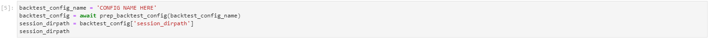

# Version 2  

This document describes v2 specific usage, syntax, configuration, and more.  

[-> Abstract](#abstract)  
[-> Setup](#setup)  
[-> Configuration (backtest_configs)](#configuration-backtest_configs)  
[-> Configuration (live_settings)](#configuration-live_settings)  
[-> Jupyter-Lab (Backtest Analysis)](#configuration-live_settings)  
[-> Usage](#usage)  


## Abstract

PassivBot Version 2 is here! This version introduces a batch of new features, stability fixes, optimizations, behavioral changes, and more. For a full list of changes, see the changelog. Some highlights:

- Dockerization  
- Speed Increases Over v1
- Improved Documentation
- Versioning Implemented
- Major Backtester Overhaul
- Minor Re-factoring
- New Usage Syntax
- Community Updates

Releases:
**[v2.0.0](https://github.com/enarjord/passivbot_futures/releases/tag/v2.0.0)** **|** **[v2.1.0](https://github.com/enarjord/passivbot_futures/releases/tag/v2.1.0)**

## Setup  

1. Clone or download your desired release from the [GitHub](https://github.com/enarjord/passivbot_futures/)

2. Install the dependencies from the root folder of the download using:
`pip install -r requirements.txt`


3. Add your API Keys to the appropriate directory as JSON files:

 - Binance: `api_key_secrets/binance/{USERNAME}.json`  
 - ByBit: `api_key_secrets/binance/{USERNAME}.json`  


  When creating API key files, the file-name will be your "username", and the keys should be provided as a string list object in the format: `["API_KEY", "API_KEY_SECRET"]`. A template file is provided as an example.


## Configuration (backtest_configs)

A template backtest configuration file is provided as a reference. It's suggested simply to duplicate the provided hjson file, rename it, and edit the necessary parameters. The name of your backtest configuration file is arbitrary, so long as there are no spaces.  

| Parameter                      	| Description                                                                                                                                                                                                                                                                                                                              	| Type                   	|
|--------------------------------	|------------------------------------------------------------------------------------------------------------------------------------------------------------------------------------------------------------------------------------------------------------------------------------------------------------------------------------------	|------------------------	|
| `session_name:`                	| Specifies the folder name where results will be output.                                                                                                                                                                                                                                                                                  	| String                 	|
| `exchange:`                    	| Specifies the exchange to use. Can be "binance" or "bybit".                                                                                                                                                                                                                                                                              	| String                 	|
| `user:`                        	| Specifies the filename of your API Keys for the given exchange.)                                                                                                                                                                                                                                                                         	| String                 	|
| `symbol:`                      	| Specifies the coin pair the bot will test. For binance, use `{COIN}USDT` Ex: BTCUSDT. For bybit, use `{COIN}USD` Ex: BTCUSD.                                                                                                                                                                                                             	| String                 	|
| `n_days:`                      	| Specifies the number of days to be tested, counted backwards from the current date.                                                                                                                                                                                                                                                      	| Integer                	|
| `starting_candidate_filepath:` 	| Specifies the location of a previously completed backtest, if you want the backtester to build upon a previously generated configuration. By default, this is `live_settings/binance/default.json`.                                                                                                                                      	| String (filepath)      	|
| `multiprocessing:`             	| Specifies whether you will use code acceleration. This can be "true" or "false". To use code acceleration, append `--jit` to your starting command (later).                                                                                                                                                                              	| Boolean                	|
| `starting_k:`                  	| Specifies how far through the backtest the tester will begin. The `starting_k` is a simple counter, but it's starting position effects the backtest's results. This can be set to any integer between 0 and the `n_jackrabbit_iterations` value.                                                                                         	| Integer                	|
| `n_jackrabbit_iterations:`     	| Specifies the maximum number of iterations jackrabbit is allowed to make. Jackrabbit is a pet name given to a simple algorithm for optimizing bot's settings. The mutation coefficient m determines the mutation range, and is inversely proportional to k, which is a simple counter. This can be any integer larger than `starting_k`. 	| Integer                	|
| `latency_simulation_ms:`       	| Specifies how much latency the backtester will anticipate. To find your latency, ping your exchange's API endpoints.                                                                                                                                                                                                                     	| Integer                	|
| `starting_balance:`            	| Specifies the balance (in USD) the backtester will test with.                                                                                                                                                                                                                                                                            	| Integer                	|
| `break_on:`                    	| Specifies the conditions that the test results must adhere to. Results that do not fit these parameters will be discarded. To turn on or off a given condition, change `OFF:` to `ON:` or vice versa. Additionally, some values within conditions may be augmented to more accurately define expected results.                           	| String Array (various) 	|
| `ranges:`                      	| All range variables are presented in a standard format: [`MIN-VALUE` , `MAX-VALUE`, `STEP`]. The MIN-VALUE is the smallest allowable value, the MAX-VALUE is the maximum allowable value, and the STEP indicates the smallest allowed specificity in generated values.                                                                   	| Integer Array          	|

## Configuration (live_settings)  

Note that the live_settings configuration file is a JSON file, while the backtest_configs configuration file is an HJSON.

| Parameter                                      	| Description                                                                                                                                                                                                                                                                                                                                          	| Type    	|
|------------------------------------------------	|------------------------------------------------------------------------------------------------------------------------------------------------------------------------------------------------------------------------------------------------------------------------------------------------------------------------------------------------------	|---------	|
| `config_name`                                  	| Arbitrary name given to settings.                                                                                                                                                                                                                                                                                                                    	| String  	|
| `symbol`                                       	| Specifies the coin pair the bot will trade on.                                                                                                                                                                                                                                                                                                       	| String  	|
| `logging_level`                                	| Logs of bot's actions are stored in directory `logs/{exchange}/{config_name}.log` If logging_level == 0: no logging. If logging_level > 0: will log positions, open orders, order creations, order cancellations.                                                                                                                                    	| Integer 	|
| `cross_mode`                                   	| Specifies whether the bot will use cross margin or isolated margin. Set to true for cross mode, false for isolated mode.                                                                                                                                                                                                                             	| Boolean 	|
| `balance_pct`                                  	| Specifies the percentage of total balance available to be used as margin. 1.0 == 100%, 0.33 == 33%.                                                                                                                                                                                                                                                  	| Float   	|
| `entry_qty_pct`                                	| Specifies the percentage to be used per-entry order. The minimum allowed entry qty is determined by the following formula: `minimum_entry_qty = balance * balance_pct * leverage * entry_qty_pct`.                                                                                                                                                   	| Float   	|
| `ddown_factor`                                 	| Specifies the amount to double down on each re-entry with. Setting 'ddown_factor' to 1.0 makes the bot double its position size each reentry.  The formula is: `reentry_qty = max(minimum_entry_qty, pos_size * ddown_factor)`                                                                                                                       	| Float   	|
| `min_close_qty_multiplier`                     	| Specifies the quantity of closing orders using the formula: `minimum_close_qty = minimum_entry_qty * min_close_qty_multiplier`                                                                                                                                                                                                                       	| Float   	|
| `leverage`                                     	| Specifies the leverage the bot will use to trade. Bot will attempt to set leverage upon startup.  If it fails to set leverage for any reason, it will ignore and start anyway.  In Binance, the user may set leverage in both cross and isolated modes.  In Bybit cross mode, the leverage is always the maximum allowable value for a given symbol. 	| Integer 	|
| `n_entry_orders`                               	| Specifies the maximum number of open limit orders per side. If set to 1, bot will keep on the order book only one bid and one ask at any time. If any order's price is more than 5% away from last price, the order is not made.                                                                                                                     	| Integer 	|
| `n_close_orders`                               	| The bot will divide the sum of its position into `n_close_orders` parts, and place equally weighted reduce-only orders.                                                                                                                                                                                                                              	| Integer 	|
| `grid_coefficient`                             	| Used in the following formula to determine next re-entry order's price: `grid_spacing_modifier = (1 + (pos_margin / (balance * balance_pct)) * grid_coefficient))`.                                                                                                                                                                                  	| Float   	|
| `grid_spacing`                                 	| Specifies the percentage distance between position price and next reentry price using the following formula: `next_entry_price = pos_price * (1 +- grid_spacing * grid_spacing_modifier)`.                                                                                                                                                           	| Float   	|
| `min_markup` and `max_markup`                  	| When there's a position, the bot makes up to `n_close_orders` reduce-only orders whose prices are evenly distributed between min and max markup, and whose quantities are defined by: `max(minimum_close_qty, pos_size // n_close_orders)`.                                                                                                          	| Float   	|
| `indicator_settings: do_long`                  	| If true, allows long positions.                                                                                                                                                                                                                                                                                                                      	| Boolean 	|
| `indicator_settings: do_shrt`                  	| If true, allows short positions.                                                                                                                                                                                                                                                                                                                     	| Boolean 	|
| `indicator_settings: funding_fee_collect_mode` 	| If `funding_fee_collect_mode` is true, bot will enter long only if predicted funding fee is < 0.0, and short only if predicted funding fee is > 0.0.                                                                                                                                                                                                 	| Boolean 	|
| `indicator_settings: tick_ema: span`           	| Specifies the adjustment rate of the exponential moving average. v2 uses a single EMA to "smooth" out initial entries and prevent entering longs at peaks, and shorts in troughs. Calculation of exponential moving average is as follows:  ``` alpha = 2 / (span + 1) ema = previous_ema * (1 - alpha) + tick * alpha ```                           	| Float   	|
| `indicator_settings: tick_ema: spread`         	| Specifies the distance between upper and lower EMA bounds. v2 uses a single EMA to "smooth" out initial entries and prevent entering longs at peaks, and shorts in troughs. Calculation of exponential moving average is as follows:  ``` alpha = 2 / (span + 1) ema = previous_ema * (1 - alpha) + tick * alpha ```                                 	| Float   	|
| `market_stop_loss`                             	| Specifies whether the bot is allowed to use market orders to preform stop losses when necessary. Otherwise, it will only use limit orders.                                                                                                                                                                                                           	| Boolean 	|
| `stop_loss_liq_diff`                           	| Specifies, as a percentage, how far away from the liquidation price that the bot will stop loss at.                                                                                                                                                                                                                                                  	| Float   	|
| `stop_loss_pos_price_diff`                     	| Specifies, as a percentage, how far away from the position price that the bot will stop loss at.                                                                                                                                                                                                                                                     	| Float   	|
| `stop_loss_pos_reduction`                      	| Specifies, as a percentage, the amount of the current open position will be shed per stop loss.                                                                                                                                                                                                                                                      	| Float   	|

## Jupyter-Lab (Backtest Analysis)  

You must install [`Jupyter-Lab`](https://jupyterlab.readthedocs.io/en/stable/getting_started/installation.html#pip) to use the included .ipynb files.

1. Open `backtest_notes.ipynb` in Jupyter, and navigate to cell 5, line 1:

2. Replace the `backtest_config_name` string with the name of your `backtest_config` configuration file. Do not include the file extension.

  

3. Return focus to cell 1, and use `Shift + Enter` to step through each cell sequentially. The cell number will change from `[1]` to `[*]` while the process is executing. When execution of the highlighted cell is complete, it will change back to the cell number and you may continue.

Stepping through each cell will save the associated data or file to the directory where the backtest results are located: `backtest_results/{exchange}/{symbol}/{session_name}`. Example backtest data is available [here](https://github.com/JohnKearney1/PassivBot-Configurations).


## Usage  

Note that your `{username}` is both the name of your API KeyFile, *and* your live_settings configuration file. These files should have identical names, without spaces. To run the bot, navigate to the root directory in a command prompt and run the associated command(s):

**Backtest ->** `python3 backtest.py {backtest_config filename} {optional: --jit}`  
**Live Bot ->** `python3 start_bot.py {exchange} {username}`  
**Jupyter-Lab ->** `jupyter-lab` *(From root dir.)*
